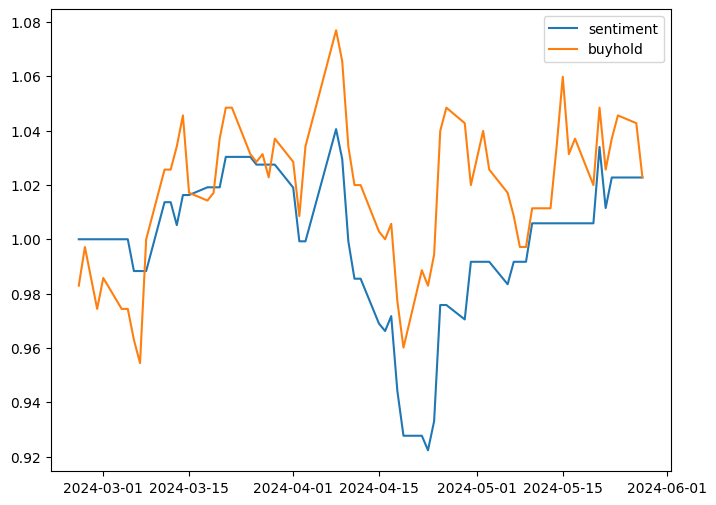
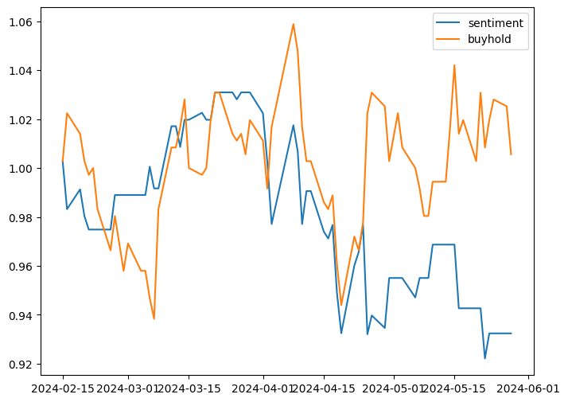
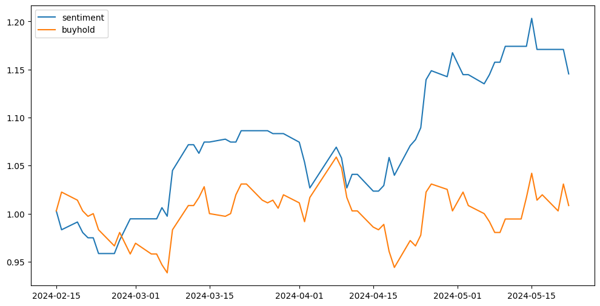

# SENTIMENT ANALYSIS AND STOCK AGENT LM
## 1. Goal
- Build sentiment analysis to trade
- Build personal stock agent with LLM
## 2. Data
### 2.1. News
- 經濟日報(UDN)
    - Text and Title
### 2.2. Price
- Yahoo finance
### 2.3. Preprocessing
- Translate Chinese data to English data: finbert model needs english input.

## 3. Sentiment Analysis

  <strong>Model pretrained: finBert-</strong> <a href="https://huggingface.co/yiyanghkust/finbert-tone">yiyanghkust/finbert-tone</a>

### 3.1. TW Stock - 0050
|                  | Pretrain   | Finetune                                               |
| ---------------- | ---------- | ------------------------------------------------------ |
| Data-Size (news) |       -    |         6623                                           |
| Asset            ||  |

### 3.2. TW Stock - 2409
|                  | Pretrain   |   Finetune - related data only | Finetune - multiple data  |
|----------------- | ---------- | ------------------------------ | ------------------------- |
| Data-Size (news) |     -      |           1301                 |    1301 + 6623           |
| Asset            |  |  | 

## 4. Personal stock agent
### 4.1. Model Pretrained
- Taide: [taide/Llama3-TAIDE-LX-8B-Chat-Alpha1](https://huggingface.co/taide/Llama3-TAIDE-LX-8B-Chat-Alpha1)
- Chinese Mediatek Model
    - Pretrained:
    - Finetune
        - Text to text
        - Text to sentiment
NOTE:
- Summarise model: llama3

## 5. Possible Improvement
- In minutes
