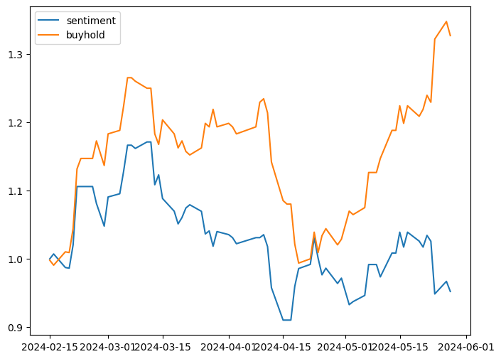

# Sentiment Analysis Performance Comparison using FinBERT

## 1. Introduction

In this analysis, we evaluate the performance of sentiment analysis using the FinBERT model on two Taiwanese stocks: TW Stock 0050 and 2409. The study involves comparing the outcomes of pretraining and finetuning phases, accompanied by backtesting strategies to gauge asset performance.

Additionally, we aim to leverage the insights gained from sentiment analysis to build a personal investment advisor. This advisor will summarize news articles and provide simple insights to assist investors in making informed decisions.


## 2. Data Overview

- **TW Stock 0050**
  - **Pretraining Data**: Not applicable (N/A)
  - **Finetuning Data**: 6623 news articles
  
- **TW Stock 2409**
  - **Pretraining Data**: N/A
  - **Finetuning Data**:
    - Related Data Only: 1301 news articles
    - Multiple Data (Related and Unrelated): 1301 + 6623 news articles

## 3. Sentiment Analysis Performance
```
### NOTE
- Finetuning Strategies:
  - Related Data Only: Finetune with news articles related to the stock.
  - Multiple Data: Finetune with both related and unrelated news articles.
- Some of the backtest results below shows flat line at the last few day since I have not update the news yet.
- The blue line is backtest result with sentiment analysis while the orange line is buy and hold strategy.
```

### 3.1. TW Stock 0050
- **Pretraining** vs. **Finetuning**

|                | Pretrain   | Finetune       |  Buy and Hold |
|:--------------:|:----------:|:--------------:|:-------------:|
| Data           |       -    |         6623   |       -       |
| Daily Avg. Ret |  0.259%    |       0.399%   |   0.250%      |
| Dailt Std.     |  0.807%    |      0.949%    |  1.31%        |
| Asset          ||  | - |

### 3.2. TW Stock 2409

|                | Pretrain   |   Finetune - Related Data Only | Finetune - Multiple Data  | Buy and Hold |
|:--------------:|:----------:|:------------------------------:|:-------------------------:|:------------:|
| Data           |     -      |           1301                 |    1301 + 6623            |     -        |
| Daily Avg. Ret |  0.043%    |        -0.09%                  |      0.167%               | 0.023%       |
| Dailt Std.     |   1.28%    |           1.35%                |          1.50%            |     1.75%    |
| Asset          |  |  |  | - |

### 3.3 TW Stock 2454

|                | Pretrain   |   Finetune - Related Data Only | Finetune - Multiple Data  | Buy and Hold |
|:--------------:|:----------:|:------------------------------:|:-------------------------:|:------------:|
| Data           |     -      |           3423                 |    3423 + 6623            |              |
| Daily Avg. Ret |    0.21%   |        -0.408%                 |    -0.035%                | 0.439%       |
| Dailt Std.     |    1.85%   |           2.551%               |      2.641%               | 2.635%       |
| Asset |  |  |  |

### 3.4 TW Stock 2330

|                | Pretrain   |   Finetune - Related Data Only | Finetune - Multiple Data  | Buy and Hold |
|:--------------:|:----------:|:------------------------------:|:-------------------------:|:------------:|
| Data           |     -      |           10195                |    10195 + 6623           |     -        |
| Daily Avg. Ret |  0.133%    |        0.097%                  |    0.131%                 |  0.32%       |
| Dailt Std.     |  1.529%    |            1.558%              |         1.562%            |    1.872%    |
| Asset          |  |  |  | - |


### 3.5 TW Stock 5871

|                | Pretrain   |   Finetune - Related Data Only | Finetune - Multiple Data  | Buy and Hold |
|:--------------:|:----------:|:------------------------------:|:-------------------------:|:------------:|
| Data           |     -      |           323                  |     323 + 6623            |         -    |
| Daily Avg. Ret |  0.125%    |       0.130%                   |        0.221%             |  -0.125%     |
| Dailt Std.     |  0.551%    |       1.01%                    |       1.022%              |   1.817%     |
| Asset          |  |  |  |


## 4. Personal stock agent
### 4.1. Model Pretrained
- Taide: [taide/TAIDE-LX-7B-Chat](https://huggingface.co/taide/TAIDE-LX-7B-Chat)


## 5. Future Directions
- Add more news data: including the keyword for industry.
