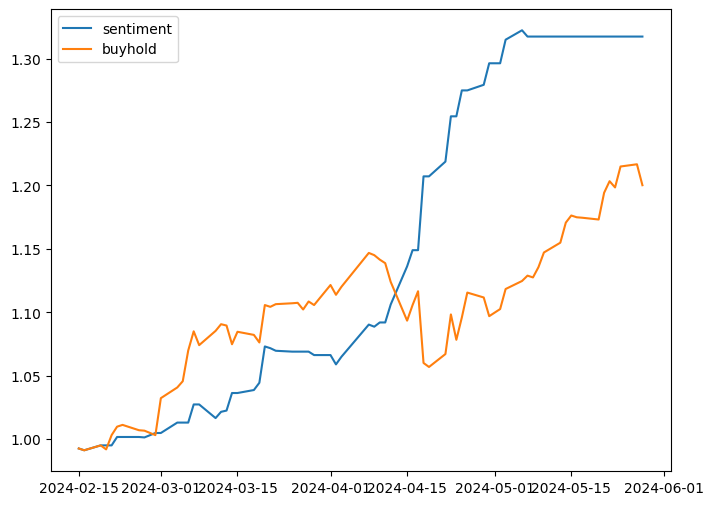

# SENTIMENT ANALYSIS AND STOCK AGENT LM
## 1. Goal
- Build sentiment analysis to trade
- Build personal stock agent with LLM
## 2. Data
- News
  - 經濟日報(UDN): Text and Title
- Price
  - Yahoo finance
- Preprocessing
  - Translate Chinese data to English data: finbert model needs english input.

## 3. Sentiment Analysis
- Model pretrained: **finBert** - yiyanghkust/finbert-tone
> Data Size: number of news to finetune
> Asset: Backtest of strategy. 
>> Blue line: trade with sentiment analysis.
>> Orange line: buy and hold.

### 3.1. TW Stock - 0050
|       | Pretrain   | Finetune                                               |
|:-----:|:----------:|:------------------------------------------------------:|
| Data  |       -    |         6623                                           |
| Asset ||  |

### 3.2. TW Stock - 2409
> Finetune - related data only: finetune with news searched by keyword related to the stock
> Finetune - multiple data: finetune with news searched by keywords that is related or unrelated to the stock

|       | Pretrain   |   Finetune - related data only | Finetune - multiple data  |
|:-----:|:----------:|:------------------------------:|:-------------------------:|
| Data  |     -      |           1301                 |    1301 + 6623            |
| Asset |  |  | 

## 4. Personal stock agent
### 4.1. Model Pretrained
- Taide: [taide/TAIDE-LX-7B-Chat](https://huggingface.co/taide/TAIDE-LX-7B-Chat)

## 5. Possible Improvement
- In minutes
