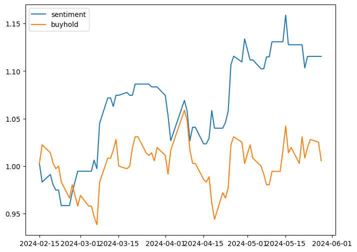

# Sentiment Analysis Performance Comparison using FinBERT

## 1. Introduction

In this analysis, we evaluate the performance of sentiment analysis using the FinBERT model on two Taiwanese stocks: TW Stock 0050 and 2409. The study involves comparing the outcomes of pretraining and finetuning phases, accompanied by backtesting strategies to gauge asset performance.

## 2. Data Overview

- **TW Stock 0050**
  - **Pretraining Data**: Not applicable (N/A)
  - **Finetuning Data**: 6623 news articles
  
- **TW Stock 2409**
  - **Pretraining Data**: N/A
  - **Finetuning Data**:
    - Related Data Only: 1301 news articles
    - Multiple Data (Related and Unrelated): 1301 + 6623 news articles

## 3. Sentiment Analysis Performance

### 3.1. TW Stock 0050
- **Pretraining** vs. **Finetuning**

|       | Pretrain   | Finetune                                               |
|:-----:|:----------:|:------------------------------------------------------:|
| Data  |       -    |         6623                                           |
| Asset ||  |

### 3.2. TW Stock 2409
- **Finetuning Strategies**:
  - **Related Data Only**: Finetune with news articles related to the stock.
  - **Multiple Data**: Finetune with both related and unrelated news articles.

|       | Pretrain   |   Finetune - Related Data Only | Finetune - Multiple Data  |
|:-----:|:----------:|:------------------------------:|:-------------------------:|
| Data  |     -      |           1301                 |    1301 + 6623            |
| Asset |  |  |  |

## 4. Insights and Conclusion

- The performance of sentiment analysis significantly improved after finetuning the FinBERT model with specific stock-related news articles.
- TW Stock 0050 exhibited promising results post-finetuning, outperforming the buy-and-hold strategy represented by the orange line.
- For TW Stock 2409, the inclusion of unrelated news articles in the finetuning phase did not significantly impact sentiment analysis performance compared to using related data only.

## 5. Future Directions

Further investigation could focus on refining the selection criteria for news articles during finetuning and exploring additional factors influencing sentiment analysis accuracy.
