# 1. Sentiment Analysis Performance Comparison using FinBERT

## Introduction
In this analysis, we evaluate the performance of sentiment analysis using the FinBERT model on two Taiwanese stocks: TW Stock 0050 and 2409. The study involves comparing the outcomes of pretraining and finetuning phases, accompanied by backtesting strategies to gauge asset performance.

## Data
- From UDN (經濟日報)

## Sentiment Analysis Performance
### NOTE
- Finetuning Data:
  - Related Data Only: Finetuned with news articles related to the stock
  - Multiple Data: Finetuned with both related and unrelated news articles
- Graphs:
  - Blue line represents the sentiment analysis strategy
  - Orange line represents the buy and hold strategy
- Some backtest results show a flat line at the last few days due to not updating the news yet
- The backtest do not take transaction fee into account

### TW Stock 0050
- **Pretraining** vs. **Finetuning**

|                | Pretrain   | Finetune       |  Buy and Hold |
|:--------------:|:----------:|:--------------:|:-------------:|
| Data           |       -    |         6623   |       -       |
| Daily Avg. Ret |  0.259%    |       0.399%   |   0.250%      |
| Dailt Std.     |  0.807%    |      0.949%    |  1.31%        |
| Asset          |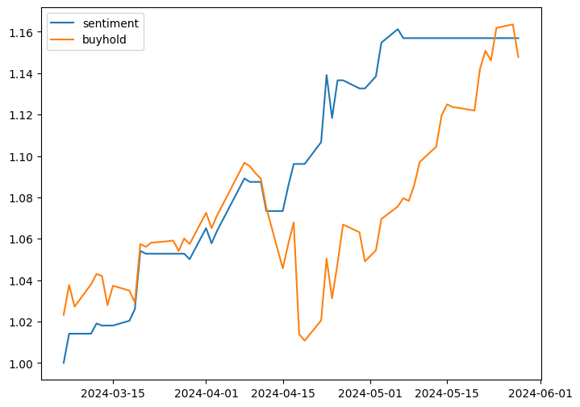| 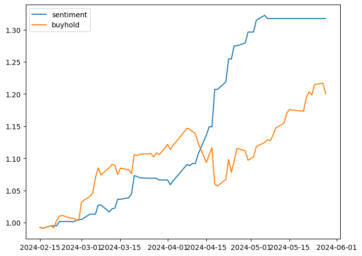 | - |

### TW Stock 2409

|                | Pretrain   |   Finetune - Related Data Only | Finetune - Multiple Data  | Buy and Hold |
|:--------------:|:----------:|:------------------------------:|:-------------------------:|:------------:|
| Data           |     -      |           1301                 |    1301 + 6623            |     -        |
| Daily Avg. Ret |  0.043%    |        -0.09%                  |      0.167%               | 0.023%       |
| Dailt Std.     |   1.28%    |           1.35%                |          1.50%            |     1.75%    |
| Asset          | 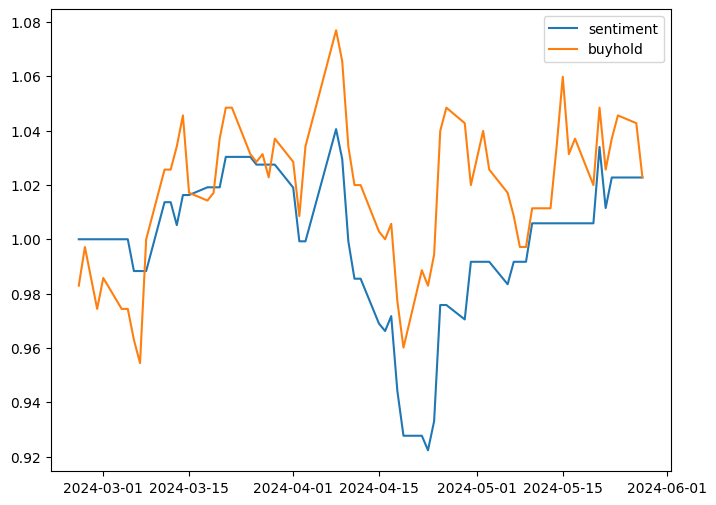 | 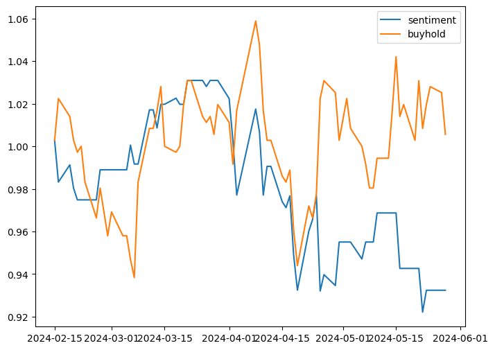 | 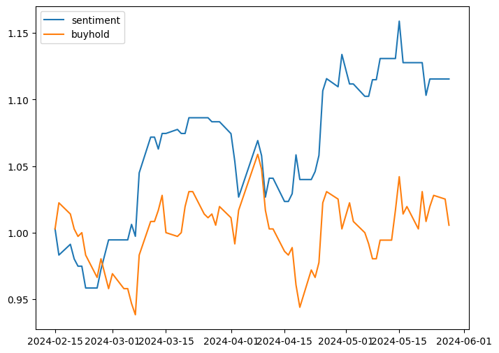 | - |

### TW Stock 2454

|                | Pretrain   |   Finetune - Related Data Only | Finetune - Multiple Data  | Buy and Hold |
|:--------------:|:----------:|:------------------------------:|:-------------------------:|:------------:|
| Data           |     -      |           3423                 |    3423 + 6623            |              |
| Daily Avg. Ret |    0.21%   |        -0.408%                 |    -0.035%                | 0.439%       |
| Dailt Std.     |    1.85%   |           2.551%               |      2.641%               | 2.635%       |
| Asset |  | 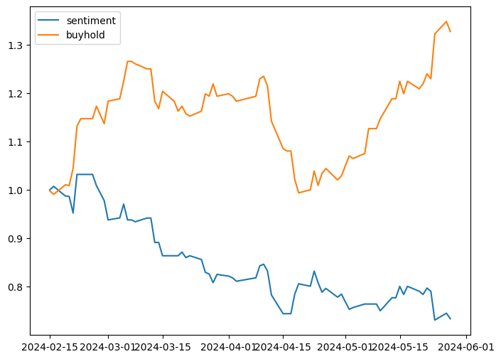 | 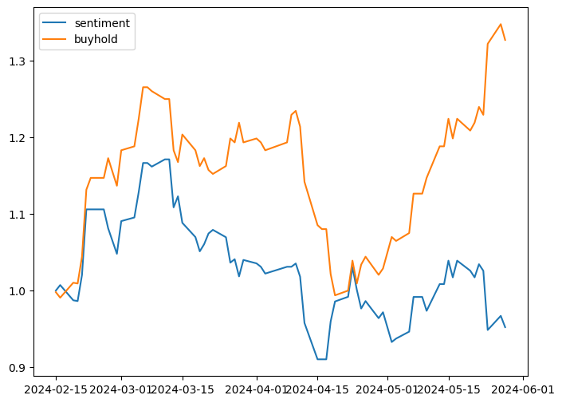 | - |

### TW Stock 2330

|                | Pretrain   |   Finetune - Related Data Only | Finetune - Multiple Data  | Buy and Hold |
|:--------------:|:----------:|:------------------------------:|:-------------------------:|:------------:|
| Data           |     -      |           10195                |    10195 + 6623           |     -        |
| Daily Avg. Ret |  0.133%    |        0.097%                  |    0.131%                 |  0.32%       |
| Dailt Std.     |  1.529%    |            1.558%              |         1.562%            |    1.872%    |
| Asset          |  | 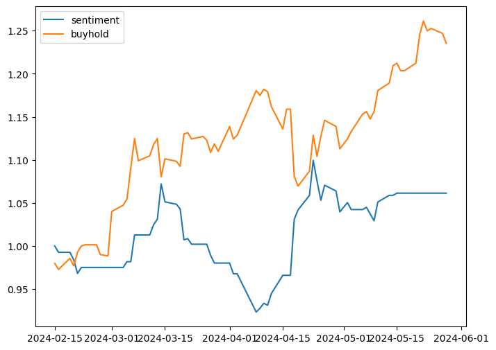 | 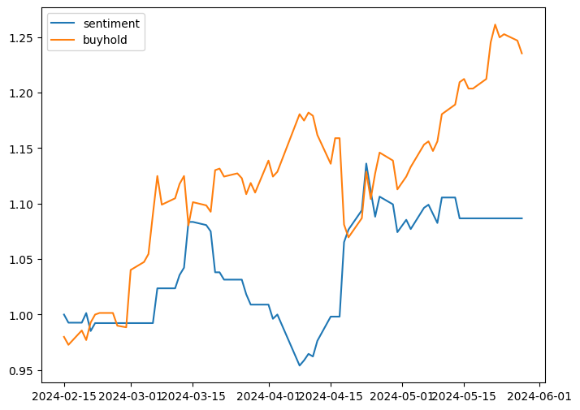 | - |

### TW Stock 5871

|                | Pretrain   |   Finetune - Related Data Only | Finetune - Multiple Data  | Buy and Hold |
|:--------------:|:----------:|:------------------------------:|:-------------------------:|:------------:|
| Data           |     -      |           323                  |     323 + 6623            |         -    |
| Daily Avg. Ret |  0.125%    |       0.130%                   |        0.221%             |  -0.125%     |
| Dailt Std.     |  0.551%    |       1.01%                    |       1.022%              |   1.817%     |
| Asset          | 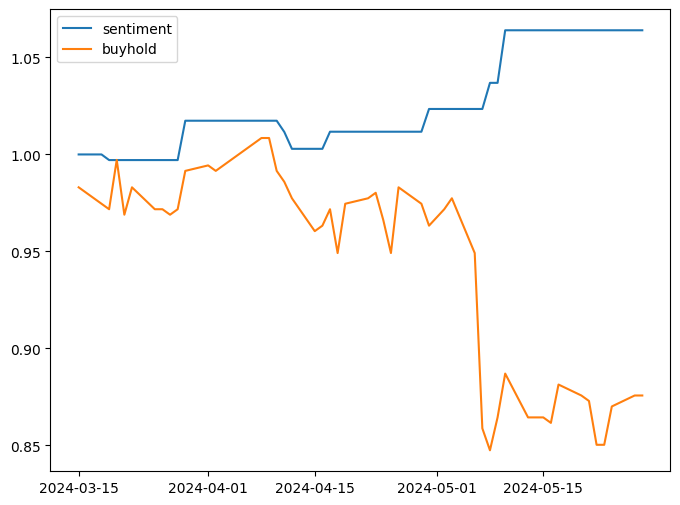 | 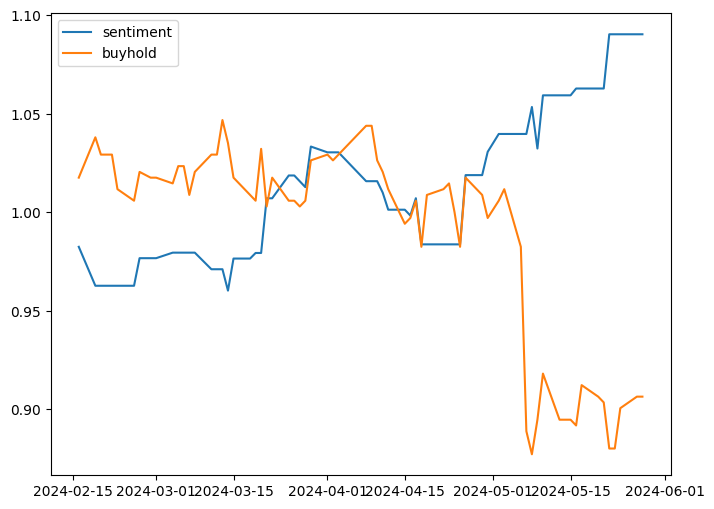 | 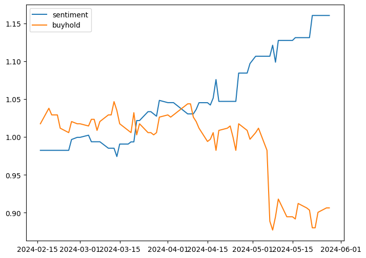 | - |

## Summary and Future Directions
- For single stocks, there may not be enough data to finetune effectively. It may be necessary to finetune with news related to other keywords.
- The two stocks where the finetuning method did not perform well (2330 and 2454) are both related to the AI industry. Keywords related to AI might be more suitable for these kinds of stocks.

# 2. Personal stock agent
## Introduction
We aim to leverage the insights gained from sentiment analysis to develop a personal investment advisor. This advisor will summarize news articles and provide clear, actionable insights to help investors make informed decisions.

## Data
- [CFGPT](https://github.com/TongjiFinLab/CFGPT)

## Model
- Taide: [taide/TAIDE-LX-7B-Chat](https://huggingface.co/taide/TAIDE-LX-7B-Chat)

## Demo

